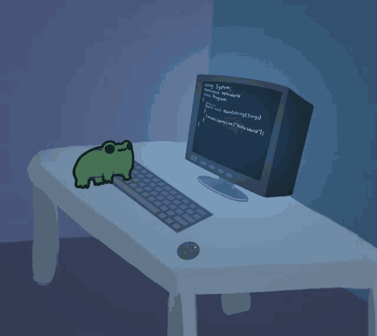

<h1 align="left"> Olá, tudo certo? 👋</h1>

Eu me chamo Jade, aqui no meu perfil você pode ver um pouco do meu processo dentro do GitHub. Estou começando uma carreira como desenvolvedora web e programadora, sendo participante da criação de um jogo educacional, blog, um portfólio e pequenos projetos ujtilizando javascript e html.

  

###

###

  
  
  
 

###

  <h3 align="center">SOBRE</h3>

  
𖣂Estudante de psicologia 𖣂Leitora 𖣂Autista/TDAH 𖣂Altas Habilidades

  

  

  
###

  

  <h1>Linguagens de domínio💻</h1>

  

    
  

###

###

  
  
  
  
  
  
  
  
  
  
  
  
  

###

<h1 align="left">Redes de Contato🗪</h1>

###

  
  
  

  

###

